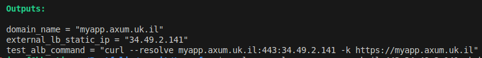

# Shielded GKE Infrastructure

## Overview

This project provisions a secure, production-grade GCP infrastructure that routes external HTTPS traffic to a private GKE-hosted application — with no direct public exposure to the cluster. The infrastructure is split across **two GCP projects** and **three Terraform phases**, each managing a distinct layer of the stack.

| Phase | Directory | Description | Team Responsibility |
|---|---|---|---|
| 1 | `internalVPC` | Private GKE cluster, Nginx Ingress (ILB), and PSC Service Attachment | Platform / Infrastructure |
| 2 | `app` | Kubernetes Deployment, Service, and Ingress resources | Application / Backend |
| 3 | `externalVPC` | External HTTPS Load Balancer, Cloud Armor WAF, and PSC NEG | Platform / Security |

The phases **must be applied in order**: `internalVPC` → `app` → `externalVPC`, since each phase depends on outputs from the previous one (e.g., the PSC Service Attachment URI is read via remote state by `externalVPC`).

---

## Architecture

[Architecture diagram here](./docs/architecture.png)

```
External User
     │
     ▼ HTTPS (443)
┌─────────────────────────────────────────────┐
│  Project A  │  VPC A (external)              │
│                                              │
│  Cloud Armor WAF                             │
│       │                                      │
│  Global External HTTPS Load Balancer         │
│  (Certificate Manager · Static IP)           │
└───────────────────┬─────────────────────────┘
                    │  Private Service Connect (PSC NEG)
                    ▼
┌─────────────────────────────────────────────┐
│  Project B  │  VPC B (internal)              │
│                                              │
│  Internal HTTPS Load Balancer (ILB)          │
│       │                                      │
│  GKE Private Cluster (Fleet-enrolled)        │
│       │                                      │
│  Nginx Ingress Controller (Helm)             │
│       │                                      │
│  App  (Deployment · Service · Ingress)       │
└─────────────────────────────────────────────┘
```

### Component breakdown

**`internalVPC` — Project B (internal)**

- **VPC & Subnets** — A dedicated internal VPC with a GKE subnet (nodes/pods/services secondary ranges) and a PSC NAT subnet.
- **Private GKE Cluster** — Deployed via the `terraform-google-modules/kubernetes-engine/google//modules/private-cluster` module. Nodes have private IPs and pull images through a Cloud NAT gateway. GCP public CIDR access is disabled.
- **GKE Fleet** — The cluster is enrolled as a Fleet member, enabling GKE Connect Gateway for `kubectl` and `helm` access without a public endpoint.
- **Node Service Account** — A dedicated service account with least-privilege IAM roles is created and bound to the node pool.
- **Nginx Ingress (ILB)** — Deployed via Helm with a reserved static internal IP. The controller is configured as a GCP Internal Load Balancer.
- **PSC Service Attachment** — Exposes the Nginx ILB forwarding rule through Private Service Connect so Project A can reach it without traversing the public internet.
- **Firewall Rules** — IAP SSH access for node troubleshooting; health check ingress for the ILB.

**`app` — Project B (internal cluster)**

- **Kubernetes Deployment** — 3-replica workload (configurable) running the application container.
- **ClusterIP Service** — Internal service selector wired to the Deployment pods.
- **Nginx Ingress resource** — Routes `/` traffic to the ClusterIP Service via the Nginx Ingress Controller provisioned in phase 1.

**`externalVPC` — Project A (external)**

- **VPC & Subnet** — A separate external VPC in Project A hosting the PSC NEG.
- **PSC NEG** — A `PRIVATE_SERVICE_CONNECT` Network Endpoint Group pointing at the Service Attachment URI exported from `internalVPC` remote state.
- **Global External HTTPS Load Balancer** — Comprising a Global Forwarding Rule, Target HTTPS Proxy, URL Map, and Backend Service backed by the PSC NEG.
- **Certificate Manager** — A self-signed TLS certificate provisioned via `tls_self_signed_cert` and attached through a Certificate Map (not the legacy `ssl_certificates` API).
- **Cloud Armor WAF** — A security policy attached to the Backend Service, blocking protocol attacks, LFI, RCE, and scanner probes using stable preconfigured rule sets.

### CIDR Allocation

IP ranges are calculated deterministically from `env_number` to allow multiple isolated environments to coexist:

| Range | Formula | Example (env 1) |
|---|---|---|
| Nodes | `10.0.0.0/8` → offset `env*2`, `/24` | `10.2.0.0/24` |
| Services | Same env block, last `/20` | `10.2.240.0/20` |
| Pods | offset `env*2+1`, `/16` | `10.3.0.0/16` |
| PSC NAT | Fixed | `10.1.0.0/24` |
| External | Fixed | `10.1.1.0/24` |

### State Management

All three phases share a single GCS bucket (`backends-all-projects`) with per-environment, per-phase prefixes:

```
backends-all-projects/
  dev-01/
    internalVPC/   ← phase 1 state
    app/           ← phase 2 state
    externalVPC/   ← phase 3 state
```

`externalVPC` reads `internalVPC` outputs using a `terraform_remote_state` data source to obtain the PSC Service Attachment URI automatically.

---

## Prerequisites

Before running any `terraform init`, ensure the following are in place:

### Tools

| Tool | Minimum Version | Notes |
|---|---|---|
| Terraform | `>= 1.14.3` | Matches `required_version` in all phases |
| `gcloud` CLI | Latest | Required for authentication and the GKE auth plugin |
| `gke-gcloud-auth-plugin` | Latest | Required for Kubernetes/Helm provider auth via Connect Gateway |
| `kubectl` | `>= 1.26` | For manual cluster interaction |
| `helm` | `>= 3.x` | Optionally used outside Terraform for debugging |

### GCP Projects (Internal + External) & APIs

Two GCP projects are required + required APIs enabled. [Instructions here](./docs/prerequisites.md)

### GCP project with GCS State Bucket to store all backends

Create the shared state bucket before any `terraform init`. 
[Instructions here](./docs/prerequisites.md#create-a-bucket-in-a-shared-project-to-store-all-backends)

### IAM Permissions

The identity running Terraform needs the following roles (or equivalents):

- **Project B:** `roles/container.admin`, `roles/iam.serviceAccountAdmin`, `roles/compute.networkAdmin`, `roles/gkehub.admin`
- **Project A:** `roles/compute.loadBalancerAdmin`, `roles/certificatemanager.editor`, `roles/compute.securityAdmin`
- **State bucket:** `roles/storage.objectAdmin` on `backends-all-projects`

### tfvars

Create a `.tfvars` file per environment per phase.

Remember that each phase is under the responsibility of a different team.
Each phase has its own envs directory.

You can find  2 sample tfvars files `dev-01.tfvars` and `prod-02.tfvars` in every phase.

Examples:

internalVPC/envs/dev-01.tfvars:
```hcl
# -------------------------------------------------------------------
# Environment identity
# -------------------------------------------------------------------
env_type = "dev"
env_number = 1
#env_name = "dev-01"

# -------------------------------------------------------------------
# Labels / cost allocation
# -------------------------------------------------------------------
owner = "golan"

# -------------------------------------------------------------------
# IAM (node service account)
# -------------------------------------------------------------------
#node_identity = "dev-01-node-identity"

node_identity_roles = [
  "roles/logging.logWriter",
  "roles/monitoring.metricWriter",
  "roles/monitoring.viewer",
]

# -------------------------------------------------------------------
# Location
# -------------------------------------------------------------------
#In case of zonal cluster (regional = false), 'zones' must include at least one zone
regional = false
zones = ["europe-west2-b"]      # London

enable_private_nodes = true
enable_private_endpoint = true

# -------------------------------------------------------------------
# GKE node configuration
# -------------------------------------------------------------------
node_instance_type = "e2-medium"  # e2-medium | e2-standard-4 | n2-standard-4
node_disk_size_gb  = 20           # 20 | 30 | 50

node_min   = 1
node_max   = 3
node_count = 1

# -------------------------------------------------------------------
# GKE cluster behavior
# -------------------------------------------------------------------
deletion_protection = false
release_channel     = "RAPID"   # RAPID | REGULAR | STABLE and more

logging_components    = ["SYSTEM_COMPONENTS"]   # "SYSTEM_COMPONENTS"
monitoring_components = ["SYSTEM_COMPONENTS"]   # "SYSTEM_COMPONENTS"

timeouts = {
  create = "10m"
}
```
terraform/app/envs/dev-01.tfvars:
```hcl
# Environment Identity
env_type   = "dev"
env_number = 1
owner      = "golan"
```

terraform/externalVPC/envs/dev-01.tfvars:
```hcl
# Environment Identity
env_type   = "dev"
env_number = 1
owner      = "golan"

# Domain Configuration
domain_name = "myapp.axum.uk.il"
```
---

## Best Practices

### Security

- **Zero public cluster exposure** — The GKE control plane and nodes are never directly reachable from the internet. All traffic flows through the PSC tunnel.

- **Cloud Armor WAF** — Pre-configured stable rule sets guard against protocol attacks, LFI, RCE, and automated scanners at the load balancer edge, before traffic enters your VPC.

- **Least-privilege node identity** — Each environment gets a dedicated GCP service account for its node pool, scoped only to the OAuth scopes it needs (logging, monitoring, GCR read).

- **Private nodes + Cloud NAT** — GKE nodes have no external IPs; outbound internet access (e.g., pulling container images) is routed through a managed Cloud NAT gateway.

- **IAP SSH** — Direct SSH to nodes is restricted to the IAP proxy IP range (`35.235.240.0/20`), avoiding the need for a bastion host.

- **Replace self-signed certs before production** — The TLS certificate is generated by `tls_self_signed_cert` for testing. In production, replace it with a Certificate Manager-managed certificate backed by a real CA or Google-managed certificate.

### Networking

- **Deterministic CIDR allocation** — CIDRs are derived from `env_number`, making it safe to spin up multiple isolated environments (dev-01, dev-02, prod-03, etc.) in the same projects without address conflicts.

- **Dedicated PSC NAT subnet** — The PSC NAT subnet is purposely scoped (`purpose = "PRIVATE_SERVICE_CONNECT"`) and kept separate from node/pod subnets.

- **Global routing mode** — The external VPC uses `routing_mode = "GLOBAL"` to ensure the load balancer can reach backends across regions if needed.

### Terraform

- **Phased apply order** — Always apply `internalVPC` first, then `app`, then `externalVPC`. The external phase reads `internalVPC` outputs via remote state; applying out of order will fail.
- **Backend reconfiguration** — Use `-reconfigure` when switching between phases to avoid state conflicts:
  ```bash
  # Phase 1
  terraform -chdir=internalVPC init -reconfigure \
    -backend-config="prefix=dev-01/internalVPC"

  # Phase 2
  terraform -chdir=app init -reconfigure \
    -backend-config="prefix=dev-01/app"

  # Phase 3
  terraform -chdir=externalVPC init -reconfigure \
    -backend-config="prefix=dev-01/externalVPC"
  ```
- **`wait = true` on the Helm release** — The Nginx Ingress Helm release uses `wait = true` so Terraform blocks until the Internal Load Balancer IP is assigned before the PSC Service Attachment attempts to read it.
- **Pin provider versions** — All providers are pinned with `~>` constraints (e.g., `google ~> 7.24.0`) to prevent unexpected upgrades from breaking the configuration.
- **Sensitive outputs marked correctly** — GKE endpoint and cluster ID outputs use `nonsensitive()` intentionally; verify this matches your security policy before sharing state remotely.
- **Testing** - After a successful `externalVPC` apply, the stack outputs a ready-to-use `curl` command to test the load balancer before DNS is configured:

  ```bash
  terraform -chdir=externalVPC output test_alb_command
  # curl --resolve dev-01.example.com:443:<IP> -k https://dev-01.example.com
  ```

## Deployment instructions
1. Setup bucket name in [backend.tf](./terraform/backend.tf).
2. Configure your desired tfvars file (per phase per environment).
3. Nevigate to the `terrform` directory
4. Set the environment variable `ENV_NAME` (e.g., `ENV_NAME=dev-01`) 
5. Loop on the 3 phases to deploy the whole project
    ```bash
    for PHASE in internalVPC app externalVPC ; 
    do
      terraform -chdir=./$PHASE init -reconfigure -backend-config "prefix=${ENV_NAME}/${PHASE}";
      terraform -chdir=./$PHASE validate;  
      terraform -chdir=./$PHASE plan -var-file ./envs/${ENV_NAME}.tfvars -out $ENV_NAME;  
      terraform -chdir=./$PHASE apply -auto-approve $ENV_NAME;
    done
    ```
6. wait a few minutes before testing. Use the curl command of the last phase output to sent https request to the web server through the external LB.

    

7. `terraform destroy -var-file ./envs/${ENV_NAME}.tfvars -auto-approve`
## Destroy instructions
1. if `deletion_protection = true`, change it to `false` and run:
    ```bash
    terraform -chdir=./internalVPC apply -var-file ./envs/${ENV_NAME}.tfvars 
    ```
2. Loop on the 3 phases to destroy the whole project
    ```bash
    for PHASE in  externalVPC app internalVPC; 
    do 
      echo $PHASE;    
      terraform -chdir=./$PHASE destroy -var-file ./envs/${ENV_NAME}.tfvars -auto-approve; 
    done
    ```

## Troubleshot

1. Connect to the cluster to run `kubectl/helm` commands

    `gcloud container fleet memberships get-credentials $ENV_NAME`

2. ssh to one of the worker nodes to invastigate internal connectivty

    `gcloud compute ssh NODE_NAME --zone=ZONE --tunnel-through-iap`
    
    or click on the `ssh` button in the VM instances console
    